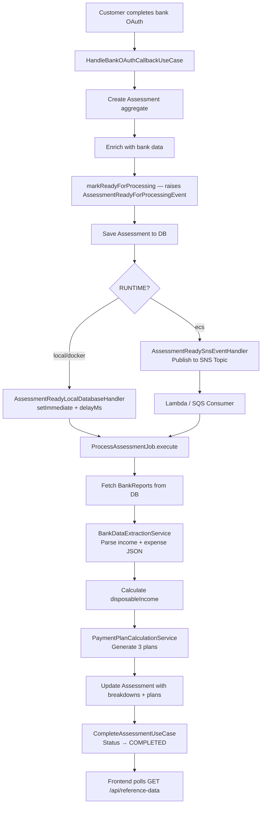
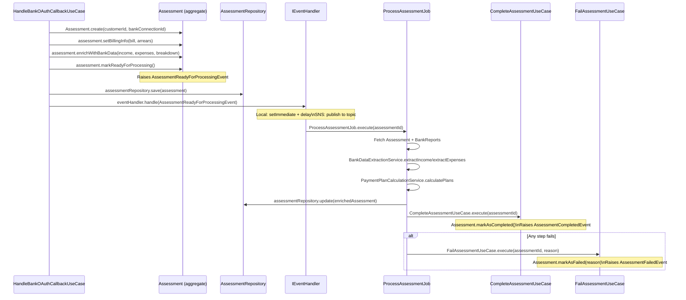

# Design Document: Async Assessment Calculation

## Overview

This document describes the technical design for the async assessment calculation feature in Project Bridge. The feature automates hardship assessment when a customer completes bank OAuth authorisation. The system creates an `Assessment` aggregate, persists raw bank data, and dispatches a background job to calculate disposable income, bill affordability ratio, hardship level, and payment plan options.

The design supports two deployment modes without code changes:

- **Production mode** (`RUNTIME=ecs`): jobs are dispatched to an AWS SQS queue and consumed by a Lambda worker.
- **Demo/local mode** (`RUNTIME=local` or `RUNTIME=docker`): jobs execute in-process after a configurable delay using `setImmediate`, requiring no cloud infrastructure.

The feature is already substantially implemented. This document captures the intended architecture, the key design decisions, and the correctness properties that the implementation must satisfy.

---

## Architecture

The system follows the project's established Clean Architecture with four layers. The async calculation pipeline spans all four layers and two deployment modes.



### Deployment Mode Selection

The event handler is selected at application startup in the bank connection router based on `NODE_ENV` (currently) / `RUNTIME` (per requirements). The use case receives the handler via constructor injection and is completely unaware of which backend is active.

```mermaid
flowchart LR
    subgraph DI Container [Bank Connection Router — DI]
        direction TB
        E{NODE_ENV}
        E -- production --> SNS[AssessmentReadySnsEventHandler]
        E -- development/local --> Local[AssessmentReadyLocalDatabaseHandler]
    end
    DI Container --> UC[HandleBankOAuthCallbackUseCase\nIEventHandler injected]
```

---

## Components and Interfaces

### Core Interfaces

**`IJobDispatcher`** (`src/core/application/services/IJobDispatcher.ts`)
```typescript
interface IJobDispatcher {
  dispatch(jobId: string): Promise<void>;
}
```

**`IBackgroundJob<T>`** (`src/core/application/services/IBackgroundJob.ts`)
```typescript
interface IBackgroundJob<T> {
  execute(input: T): Promise<Result<void, Error>>;
}
```

**`IEventHandler<E>`** (`src/core/application/services/IEventHandler.ts`)
```typescript
interface IEventHandler<E> {
  handle(event: E): Promise<void>;
}
```

### Component Responsibilities

| Component | Layer | Responsibility |
|---|---|---|
| `HandleBankOAuthCallbackUseCase` | Application | Orchestrates OAuth callback: fetches bank data, creates Assessment aggregate, raises domain event, publishes via injected handler |
| `Assessment` (aggregate root) | Domain | Encapsulates financial state, hardship/sustainability calculations, status lifecycle, domain event emission |
| `AssessmentReadyForProcessingEvent` | Domain | Domain event raised when an Assessment is ready for background processing |
| `AssessmentReadyLocalDatabaseHandler` | Infrastructure | In-process event handler for demo/local mode; executes job after configurable delay |
| `AssessmentReadySnsEventHandler` | Infrastructure | Production event handler; publishes event to AWS SNS topic |
| `AwsSqsJobDispatcher` | Infrastructure | Sends job message to SQS queue (production mode) |
| `LocalJobDispatcher` | Infrastructure | Executes job in-process via `setImmediate` (demo mode) |
| `ProcessAssessmentJob` | Infrastructure | Background job: parses bank data, calculates plans, updates Assessment, calls Complete/Fail use cases |
| `BankDataExtractionService` | Infrastructure | Parses raw Tink income/expense JSON into structured `IncomeBreakdown` / `ExpenseBreakdown` |
| `PaymentPlanCalculationService` | Application | Generates Conservative, Balanced, Aggressive payment plans from disposable income and arrears |
| `CompleteAssessmentUseCase` | Application | Transitions Assessment to `COMPLETED`, raises `AssessmentCompletedEvent` |
| `FailAssessmentUseCase` | Application | Transitions Assessment to `FAILED`, raises `AssessmentFailedEvent` |
| `GetReferenceDataUseCase` | Application | Aggregates account setup, bank connection, and assessment data for the frontend polling endpoint |
| `ReferenceDataController` | Infrastructure | HTTP controller for `GET /api/reference-data` and assessment lifecycle endpoints |

### Event Flow



---

## Data Models

### Assessment (Prisma model)

The `Assessment` model stores both the initial financial snapshot (set during OAuth callback) and the enriched calculation results (set by `ProcessAssessmentJob`).

```
Assessment {
  id                String    -- CUID, primary key
  customerId        String    -- FK to Customer
  bankConnectionId  String?   -- FK to BankConnection
  mandateId         String?   -- FK to Mandate (set later)

  -- Initial snapshot (set during OAuth callback)
  monthlyIncome     Float?
  monthlyExpenses   Float?
  monthlyBill       Float?
  arrears           Float?

  -- Calculated fields (set by ProcessAssessmentJob)
  disposableIncome  Float?
  billRatio         Float?
  hardshipLevel     String?   -- NONE | LOW | MODERATE | SEVERE
  sustainabilityScore String? -- HIGH | MEDIUM | LOW

  -- JSON breakdown fields (set by ProcessAssessmentJob)
  incomeBreakdown   String?   -- JSON: IncomeBreakdown
  expenseBreakdown  String?   -- JSON: ExpenseBreakdown
  expensesByCategory String?  -- JSON: Record<string, number>
  incomeHistory     String?   -- JSON: array of monthly income
  incomeSources     String?   -- JSON: array of income source objects
  factors           String?   -- JSON: array of factor objects
  paymentPlans      String?   -- JSON: PaymentPlan[]

  selectedPlan      String?   -- Conservative | Balanced | Aggressive
  status            String    -- PENDING | COMPLETED | FAILED

  createdAt         DateTime
  updatedAt         DateTime
}
```

### AssessmentJob (Prisma model)

Tracks the lifecycle of a single background calculation job.

```
AssessmentJob {
  id            String    -- CUID, primary key
  assessmentId  String    -- FK to Assessment (unique — one job per assessment)
  status        String    -- PENDING | SUCCESS | FAILED
  errorMessage  String?   -- Set on failure
  retryCount    Int       -- Incremented on each failure
  createdAt     DateTime
  processedAt   DateTime? -- Set when job transitions to SUCCESS or FAILED
}
```

### BankReports (Prisma model)

Stores raw Tink API responses for later re-processing.

```
BankReports {
  id                   String
  bankConnectionId     String    -- FK to BankConnection (unique)
  expensesJson         String    -- Raw Tink expense check response
  incomeJson           String    -- Raw Tink income report response
  totalMonthlyExpenses Float
  totalMonthlyIncome   Float
  createdAt            DateTime
  expiresAt            DateTime?
}
```

### Domain Value Types

```typescript
// Assessment status lifecycle
type AssessmentStatus = 'PENDING' | 'COMPLETED' | 'FAILED';

// Hardship classification
type HardshipLevel = 'NONE' | 'LOW' | 'MODERATE' | 'SEVERE';

// Sustainability classification
type SustainabilityScore = 'HIGH' | 'MEDIUM' | 'LOW';

// Payment plan type
type PlanType = 'Conservative' | 'Balanced' | 'Aggressive';

// Payment plan shape (stored as JSON array in Assessment.paymentPlans)
interface PaymentPlan {
  type: PlanType;
  monthlyAmount: number;
  duration: number;       // months
  totalRepayment: number;
  sustainability: SustainabilityScore;
}

// Income breakdown (stored as JSON in Assessment.incomeBreakdown)
interface IncomeBreakdown {
  salary: number;
  pension: number;
  benefits: number;
  cashDeposits: number;
  other: number;
  total: number;
}

// Expense breakdown (stored as JSON in Assessment.expenseBreakdown)
interface ExpenseBreakdown {
  housing: number;
  food: number;
  utilities: number;
  transport: number;
  other: number;
  total: number;
}
```

### Hardship Calculation Rules

The `Assessment` aggregate computes hardship level and sustainability score as pure functions of its financial state:

```
disposableIncome = monthlyIncome − monthlyExpenses

billRatio = (monthlyBill / disposableIncome) × 100  [rounded to 2 d.p.]
          = +Infinity  when disposableIncome ≤ 0

hardshipLevel:
  SEVERE    when disposableIncome ≤ 0
  SEVERE    when billRatio > 100
  SEVERE    when billRatio > 25
  MODERATE  when billRatio > 10
  LOW       when billRatio > 5
  NONE      when billRatio ≤ 5

sustainabilityScore:
  LOW       when disposableIncome ≤ 0
  LOW       when billRatio > 100
  MEDIUM    when billRatio > 25
  HIGH      otherwise
```

### Payment Plan Calculation Rules

`PaymentPlanCalculationService` generates three plans from `disposableIncome`, `arrears`, and `monthlyBill`:

```
billRatio = (monthlyBill / disposableIncome) × 100
isSevereBill = billRatio > 25

Conservative monthly = disposableIncome × (10% if isSevereBill else 14%)
Balanced monthly     = disposableIncome × (12% if isSevereBill else 18%)
Aggressive monthly   = disposableIncome × (14% if isSevereBill else 20%)

duration = ceil(arrears / monthlyAmount)
totalRepayment = arrears
```

---

## Correctness Properties

*A property is a characteristic or behavior that should hold true across all valid executions of a system — essentially, a formal statement about what the system should do. Properties serve as the bridge between human-readable specifications and machine-verifiable correctness guarantees.*

### Property 1: Disposable income is income minus expenses

*For any* non-negative `monthlyIncome` and `monthlyExpenses`, the `Assessment` aggregate's `calculateDisposableIncome()` SHALL return `monthlyIncome − monthlyExpenses` rounded to two decimal places.

**Validates: Requirements 4.3**

---

### Property 2: Bill ratio is bill over disposable income

*For any* positive `disposableIncome` and non-negative `monthlyBill`, the `Assessment` aggregate's `calculateBillRatio()` SHALL return `(monthlyBill / disposableIncome) × 100` rounded to two decimal places.

**Validates: Requirements 5.1**

---

### Property 3: Hardship level classification is total and correct

*For any* combination of `monthlyIncome`, `monthlyExpenses`, and `monthlyBill`, the `Assessment` aggregate's `getHardshipLevel()` SHALL return:
- `SEVERE` when `disposableIncome ≤ 0` or `billRatio > 25`
- `MODERATE` when `billRatio > 10` and `billRatio ≤ 25`
- `LOW` when `billRatio > 5` and `billRatio ≤ 10`
- `NONE` when `billRatio ≤ 5`

Every possible input must map to exactly one level (the classification is total and non-overlapping).

**Validates: Requirements 5.2, 5.3, 5.4, 5.5, 5.6, 5.7**

---

### Property 4: Sustainability score classification is consistent with hardship

*For any* combination of `monthlyIncome`, `monthlyExpenses`, and `monthlyBill`, the `Assessment` aggregate's `getSustainabilityScore()` SHALL return:
- `LOW` when `disposableIncome ≤ 0` or `billRatio > 100`
- `MEDIUM` when `billRatio > 25` and `billRatio ≤ 100`
- `HIGH` when `billRatio ≤ 25` and `disposableIncome > 0`

**Validates: Requirements 5.8**

---

### Property 5: Payment plan generation always produces exactly three plans

*For any* positive `disposableIncome` and positive `arrears`, `PaymentPlanCalculationService.calculatePlans()` SHALL return an array of exactly three plans with types `Conservative`, `Balanced`, and `Aggressive` in that order.

**Validates: Requirements 6.1**

---

### Property 6: Payment plan monthly amounts follow the percentage formulas

*For any* positive `disposableIncome` and positive `arrears` where `billRatio ≤ 25` (non-severe bill):
- The Conservative plan's `monthlyAmount` SHALL equal `round(disposableIncome × 0.14)`
- The Balanced plan's `monthlyAmount` SHALL equal `round(disposableIncome × 0.18)`
- The Aggressive plan's `monthlyAmount` SHALL equal `round(disposableIncome × 0.20)`

**Validates: Requirements 6.2, 6.3, 6.4**

---

### Property 7: Payment plan duration covers full arrears repayment

*For any* positive `arrears` and positive `monthlyAmount`, the plan's `duration` SHALL equal `ceil(arrears / monthlyAmount)`, ensuring the total repayment schedule covers the full arrears balance.

**Validates: Requirements 6.5**

---

### Property 8: Newly created Assessment always starts in PENDING status

*For any* `customerId` and optional `bankConnectionId`, `Assessment.create()` SHALL produce an Assessment with `status === 'PENDING'`.

**Validates: Requirements 7.2, 1.1**

---

### Property 9: Assessment status transitions are correct and raise the right events

*For any* Assessment in any state:
- Calling `markAsCompleted()` SHALL set `status` to `COMPLETED` and add exactly one `AssessmentCompletedEvent` to the domain events list.
- Calling `markAsFailed(reason, errorCode)` SHALL set `status` to `FAILED` and add exactly one `AssessmentFailedEvent` with the matching `reason` and `errorCode` to the domain events list.

**Validates: Requirements 7.3, 7.4**

---

### Property 10: Error propagation — unexpected exceptions never escape ProcessAssessmentJob

*For any* unexpected exception thrown at any point inside `ProcessAssessmentJob.execute()`, the method SHALL catch the exception, log it at error level, attempt to mark the Assessment as `FAILED`, and return `Result.fail(...)` rather than propagating the exception to the caller.

**Validates: Requirements 4.8, 10.4**

---

### Property 11: SQS dispatcher propagates errors without swallowing them

*For any* error thrown by the SQS `sendMessage` call, `AwsSqsJobDispatcher.dispatch()` SHALL propagate that error to the caller unchanged (i.e., the caller receives the same error that SQS threw).

**Validates: Requirements 2.3**

---

### Property 12: Local dispatcher error isolation — job failures do not crash the host process

*For any* error thrown by `ProcessAssessmentJob.execute()` inside the `setImmediate` callback, `LocalJobDispatcher` SHALL log the error at error level and SHALL NOT propagate the exception to the Node.js process event loop (i.e., the host process continues running).

**Validates: Requirements 3.4**

---

## Error Handling

### Pipeline Failure Strategy

`ProcessAssessmentJob` uses a defensive pipeline pattern: every step returns a `Result<T, Error>`, and any failure immediately calls `FailAssessmentUseCase` before returning `Result.fail`. This ensures the Assessment is never left in a permanently `PENDING` state.

```
execute(assessmentId):
  1. findById(assessmentId)         → fail → FailAssessment + return fail
  2. findBankReports(connectionId)  → fail → FailAssessment + return fail
  3. parseJSON(incomeJson)          → fail → FailAssessment + return fail
  4. extractIncome(incomeData)      → fail → FailAssessment + return fail
  5. extractExpenses(expenseData)   → fail → FailAssessment + return fail
  6. calculatePlans(...)            → (always returns array, may be empty)
  7. update(enrichedAssessment)     → fail → return fail
  8. CompleteAssessmentUseCase      → fail → return fail
  catch (unexpected)                → FailAssessment + return fail
```

### Error Codes

| Error Code | Trigger |
|---|---|
| `BANK_DATA_PROCESSING_FAILED` | BankReports not found, JSON parse failure, or extraction failure |
| `ASSESSMENT_NOT_FOUND` | Assessment record missing for given ID |
| `COMPLETE_ASSESSMENT_FAILED` | CompleteAssessmentUseCase persistence failure |

### OAuth Callback Atomicity

The OAuth callback creates the Assessment and BankReports records before dispatching the job. If Assessment creation fails, no job is dispatched. The `HandleBankOAuthCallbackUseCase` does not create a separate `AssessmentJob` record — the `AssessmentJob` is created by the Prisma repository as part of the `Assessment.save()` operation (via the `assessmentJob` relation in the schema).

### Configuration Validation

The Zod configuration schema (`config.schema.ts`) validates all required environment variables at startup. If any required value is missing or invalid, `createConfig()` throws with a descriptive error listing all failing fields. The application will not start in an invalid configuration state.

---

## Testing Strategy

### Unit Tests (Domain Layer)

Test the `Assessment` aggregate's pure calculation methods in isolation. These tests require no database or external services.

Focus areas:
- `calculateDisposableIncome()` — arithmetic correctness
- `calculateBillRatio()` — arithmetic correctness, division by zero handling
- `getHardshipLevel()` — all classification branches
- `getSustainabilityScore()` — all classification branches
- `markAsCompleted()` / `markAsFailed()` — status transitions and domain event emission
- `Assessment.create()` — initial state invariants

### Unit Tests (Application Layer)

Test use cases with mocked repositories and services.

Focus areas:
- `CompleteAssessmentUseCase` — happy path, assessment not found, persistence failure
- `FailAssessmentUseCase` — happy path, assessment not found, persistence failure
- `PaymentPlanCalculationService` — plan generation for various income/arrears/bill combinations
- `ProcessAssessmentJob` — full pipeline with mocked dependencies, each failure branch

### Integration Tests (Infrastructure Layer)

Test infrastructure components with mocked external services.

Focus areas:
- `AwsSqsJobDispatcher` — SQS message format, error propagation
- `LocalJobDispatcher` — non-blocking dispatch, delay behaviour, error isolation
- `BankDataExtractionService` — income/expense parsing from realistic Tink JSON fixtures
- `PrismaAssessmentRepository` — save/update/findById with a real SQLite test database

### HTTP Tests (Presentation Layer)

Test the `GET /api/reference-data` endpoint end-to-end.

Focus areas:
- Authenticated request returns full assessment data when `COMPLETED`
- `PENDING` assessment returns status without calculated fields
- `FAILED` assessment returns status with error context
- Missing assessment returns a non-5xx response
- Unauthenticated request returns HTTP 401

### Property-Based Tests

The project uses **Jest** as the test runner. Property-based tests should use **fast-check** (`npm install --save-dev fast-check`), which integrates natively with Jest.

Each property test must run a minimum of **100 iterations**.

Tag format for each test: `// Feature: async-assessment-calculation, Property N: <property text>`

**Recommended property test targets:**

| Property | Test file | fast-check arbitraries |
|---|---|---|
| P1: Disposable income | `assessment.entity.test.ts` | `fc.float()` for income/expenses |
| P2: Bill ratio | `assessment.entity.test.ts` | `fc.float({ min: 0.01 })` for disposable, `fc.float({ min: 0 })` for bill |
| P3: Hardship classification | `assessment.entity.test.ts` | `fc.float()` for all three financial inputs |
| P4: Sustainability score | `assessment.entity.test.ts` | Same as P3 |
| P5: Three plans always generated | `PaymentPlanCalculationService.test.ts` | `fc.float({ min: 0.01 })` for income/arrears |
| P6: Plan percentage formulas | `PaymentPlanCalculationService.test.ts` | `fc.float({ min: 0.01 })` for income/arrears, low bill ratio |
| P7: Plan duration covers arrears | `PaymentPlanCalculationService.test.ts` | `fc.float({ min: 0.01 })` for arrears/monthlyAmount |
| P8: Initial PENDING status | `assessment.entity.test.ts` | `fc.string()` for customerId/bankConnectionId |
| P9: Status transitions + events | `assessment.entity.test.ts` | `fc.string()` for reason/errorCode |
| P10: Exception containment | `ProcessAssessmentJob.test.ts` | `fc.string()` for error messages |
| P11: SQS error propagation | `AwsSqsJobDispatcher.test.ts` | `fc.string()` for error messages |
| P12: Local dispatcher isolation | `LocalJobDispatcher.test.ts` | `fc.string()` for error messages |
