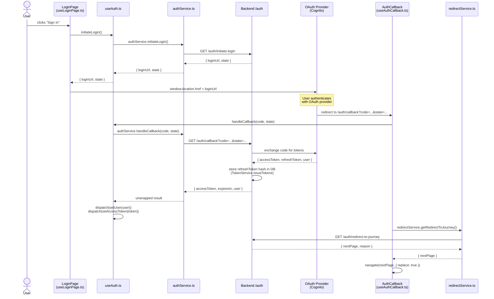
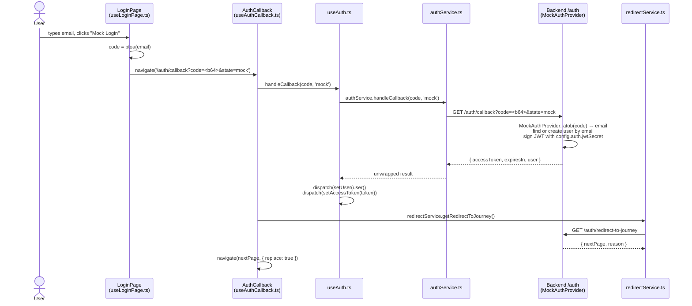
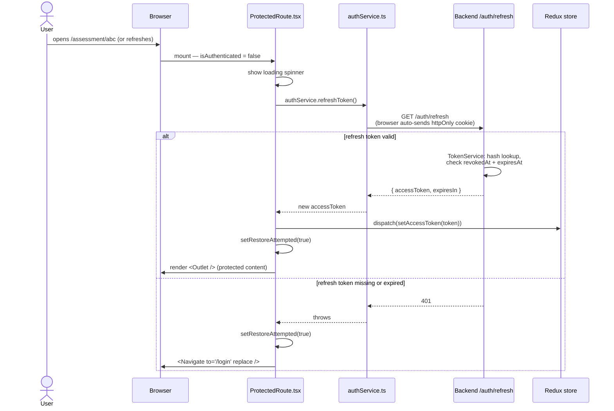
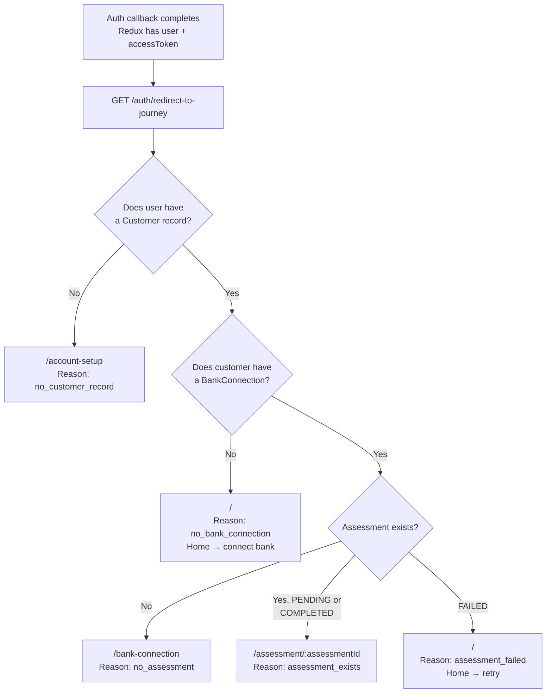
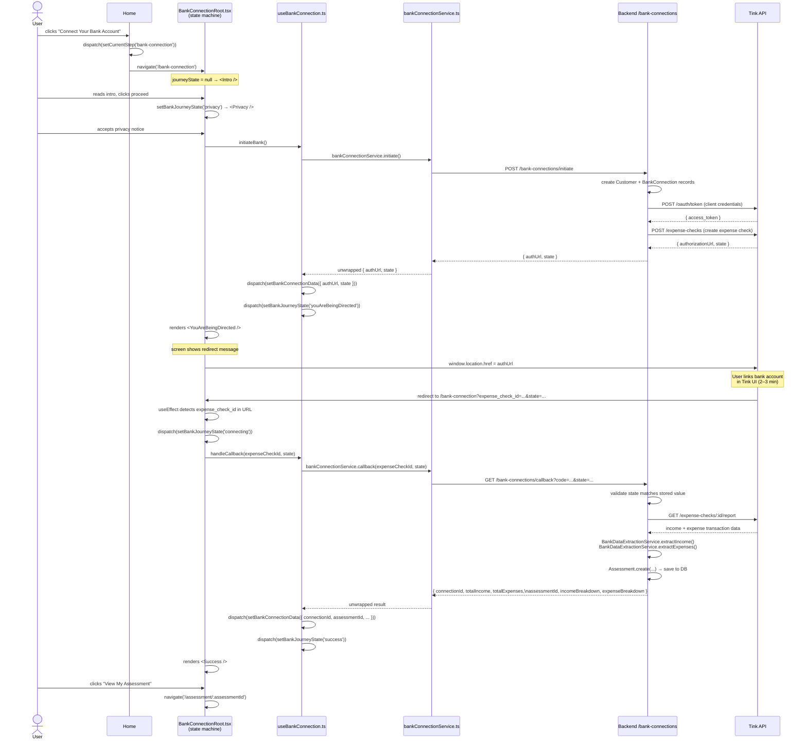
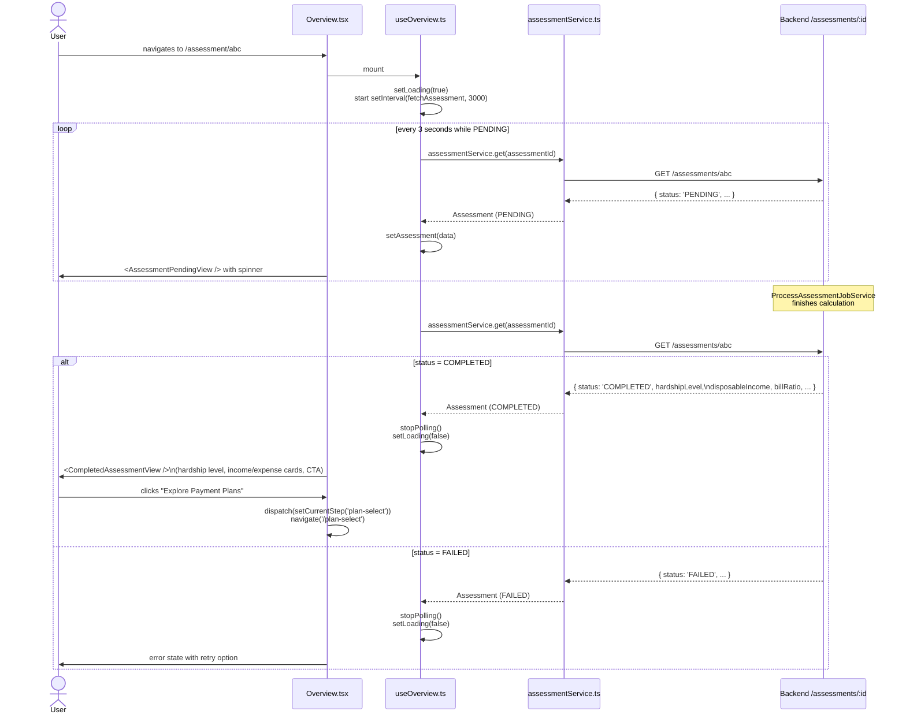
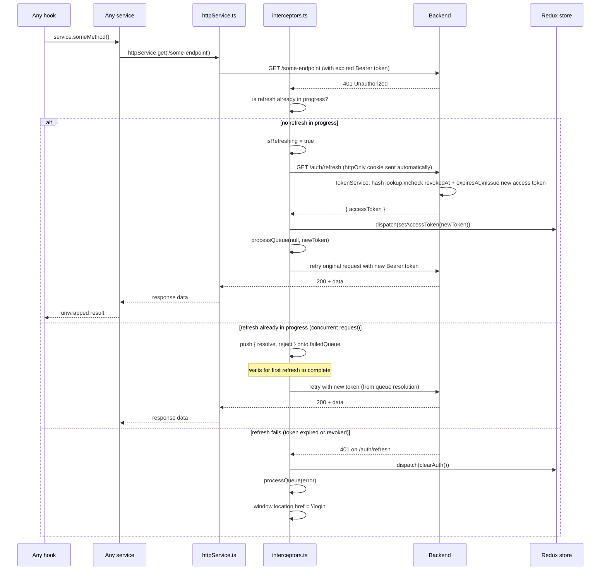

# System Flows

End-to-end traces for the five most complex flows in PROJECT BRIDGE. Each section has a plain-English walkthrough followed by a Mermaid sequence diagram with file references.

---

## Table of Contents

1. [Sign-In (OAuth)](#1-sign-in-oauth)
2. [Sign-In (Mock / Dev)](#2-sign-in-mock--dev)
3. [Session Restore on Page Load](#3-session-restore-on-page-load)
4. [Journey Selection After Auth](#4-journey-selection-after-auth)
5. [Bank Connection (Tink OAuth)](#5-bank-connection-tink-oauth)
6. [Assessment Polling](#6-assessment-polling)
7. [Silent Token Refresh (401 Interceptor)](#7-silent-token-refresh-401-interceptor)

---

## 1. Sign-In (OAuth)

**What happens:**
User clicks "Sign In". The frontend asks the backend for a login URL, redirects the browser to the OAuth provider (Cognito), and waits. When the provider redirects back to `/auth/callback`, the frontend exchanges the code for tokens, stores them in Redux, then asks the backend which page the user should see next.

**Key files:**
- `frontend/src/journeys/Login/useLoginPage.ts` — initiates login
- `frontend/src/hooks/useAuth.ts` — calls `authService.initiateLogin()`
- `frontend/src/services/authService.ts` — `GET /auth/initiate-login`
- `frontend/src/journeys/Auth/useAuthCallback.ts` — handles the redirect back
- `frontend/src/services/redirectService.ts` — `GET /auth/redirect-to-journey`
- `backend/src/application/use-cases/auth/InitiateLoginUseCase.ts`
- `backend/src/application/use-cases/auth/HandleAuthCallbackUseCase.ts`
- `backend/src/application/services/TokenService.ts`

---

## 2. Sign-In (Mock / Dev)

**What happens:**
Development-only shortcut. The user types an email and clicks "Mock Login". The frontend base64-encodes the email as a fake `code` and navigates directly to `/auth/callback` with `state=mock`, skipping the OAuth provider entirely. The rest of the callback flow is identical to real OAuth.

**Key files:**
- `frontend/src/journeys/Login/useLoginPage.ts` — `handleMockLogin()`
- `frontend/src/journeys/Auth/useAuthCallback.ts` — same callback handler as OAuth
- `backend/src/infrastructure/auth/MockAuthProvider.ts` — decodes email from base64

---

## 3. Session Restore on Page Load

**What happens:**
When the user refreshes the page or opens a protected URL directly, the access token is gone from Redux (in-memory only). `ProtectedRoute` fires one refresh attempt using the httpOnly cookie that the browser sends automatically. If the refresh succeeds the user sees their page; if it fails they are sent to `/login`.

**Key files:**
- `frontend/src/components/auth/ProtectedRoute.tsx`
- `frontend/src/services/authService.ts` — `refreshToken()`
- `backend/src/presentation/routes/auth.routes.ts` — `GET /auth/refresh`
- `backend/src/application/services/TokenService.ts` — `refreshAccessToken()`

---

## 4. Journey Selection After Auth

**What happens:**
After every successful auth callback (OAuth or mock), the frontend calls `GET /auth/redirect-to-journey`. The backend inspects the user's state in the database and returns the right page. This is the single decision point that routes users to the correct place.

**Key files:**
- `frontend/src/journeys/Auth/useAuthCallback.ts` — calls `redirectService`
- `frontend/src/services/redirectService.ts`
- `backend/src/presentation/controllers/AuthController.ts` — `getRedirectToJourney()`

> **Note:** The exact branching logic lives in the backend controller. The frontend receives only `nextPage` (a URL string) and `reason` (a string label) — it does not reimplement any of this logic.

---

## 5. Bank Connection (Tink OAuth)

**What happens:**
The most complex customer-facing flow. It has two separate HTTP round-trips separated by a full browser redirect to Tink's UI. The frontend tracks progress with a Redux state machine (`bankJourneyState`).

**States:** `intro → privacy → youAreBeingDirected → [Tink UI] → connecting → success | error`

**Key files:**
- `frontend/src/journeys/BankConnection/BankConnectionRoot.tsx` — state machine renderer + OAuth callback detection
- `frontend/src/journeys/BankConnection/hooks/useBankConnection.ts` — `initiateBank()`, `handleCallback()`
- `frontend/src/services/bankConnectionService.ts`
- `backend/src/application/use-cases/InitiateBankOAuthUseCase.ts`
- `backend/src/application/use-cases/HandleBankOAuthCallbackUseCase.ts`
- `backend/src/infrastructure/services/TinkOAuthService.ts`
- `backend/src/infrastructure/services/BankDataExtractionService.ts`

---

## 6. Assessment Polling

**What happens:**
When the user lands on `/assessment/:assessmentId`, the backend assessment record may still be `PENDING` (the processing job hasn't finished). `useOverview` immediately fetches the assessment and starts a 3-second poll. Once the status becomes `COMPLETED` or `FAILED`, polling stops and the correct view renders.

**Key files:**
- `frontend/src/journeys/Assessment/screens/overview/useOverview.ts`
- `frontend/src/services/assessmentService.ts`
- `backend/src/presentation/controllers/AssessmentController.ts`
- `backend/src/application/services/ProcessAssessmentJobService.ts`

---

## 7. Silent Token Refresh (401 Interceptor)

**What happens:**
Access tokens expire after 15 minutes. When any request returns a 401, the axios interceptor silently fetches a new access token using the httpOnly refresh-token cookie and retries the original request — transparently to the calling service or hook. If multiple requests fail simultaneously, they are all queued and retried together once the refresh completes.

**Key files:**
- `frontend/src/api/interceptors.ts` — the entire flow lives here
- `frontend/src/services/authService.ts` — `refreshToken()`
- `backend/src/application/services/TokenService.ts` — validates + rotates token

> **Guard against infinite loops:** The interceptor explicitly checks whether the failing request is `/auth/refresh` itself. If it is, the retry logic is skipped — the 401 bubbles up and `clearAuth()` + redirect runs immediately.
