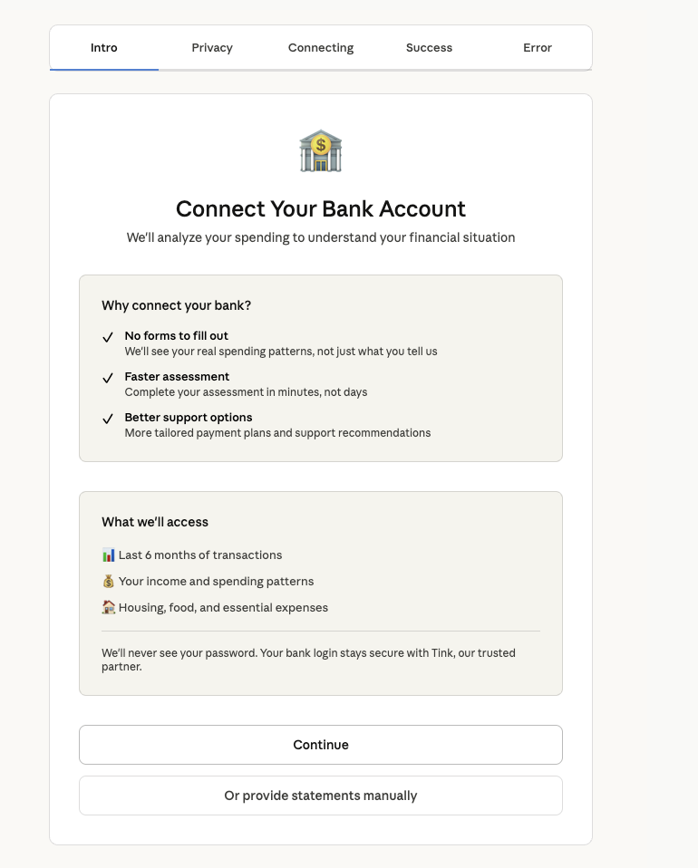
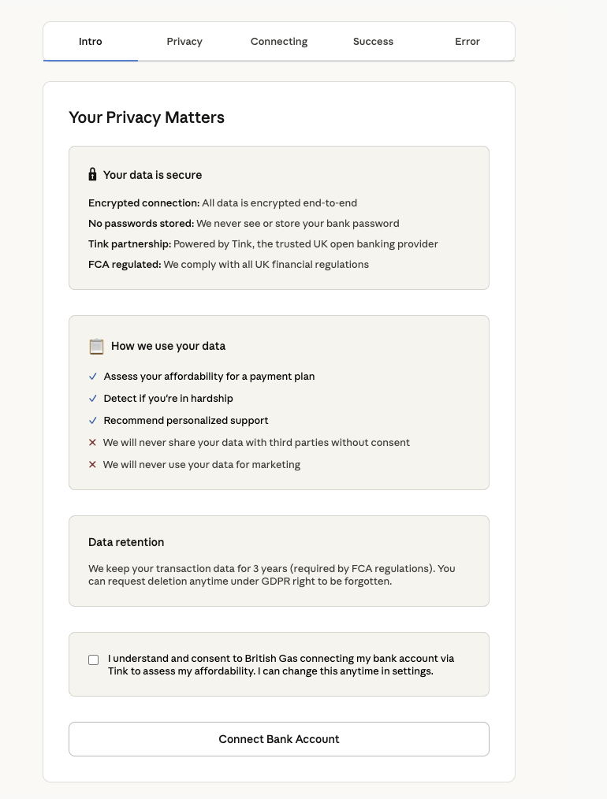
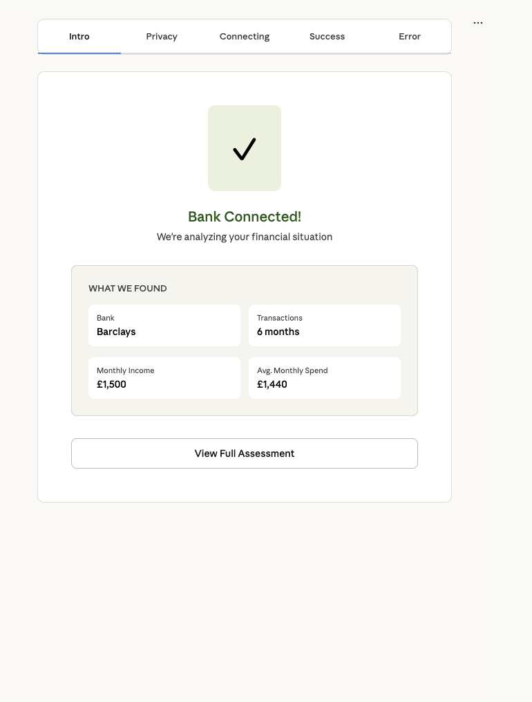
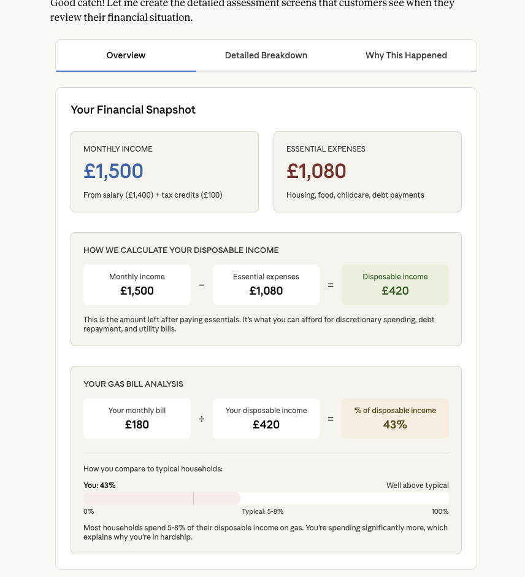
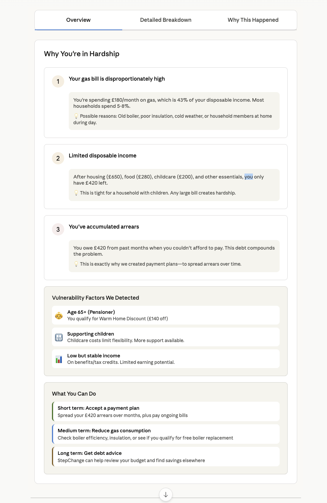

# PROJECT BRIDGE 🌉

> A hardship assessment platform for UK utility companies that identifies customers struggling with bills and creates fair, sustainable payment plans.

  

---

## 📋 Overview

**PROJECT BRIDGE** helps UK utility companies prevent wrongful disconnections by:

1. **Assessing customer hardship** using automated analysis of income, expenses, and bill affordability
2. **Creating personalized payment plans** (Conservative, Balanced, Aggressive)
3. **Managing compliance** with FCA (Financial Conduct Authority) and Ofgem regulations
4. **Protecting vulnerable customers** through the Priority Services Register (PSR)

---

## 🎯 Key Features

### For Customers
- **Secure bank connection** via Tink OAuth (read-only access)
- **Automated hardship assessment** based on real financial data
- **Transparent payment plans** with sustainability scoring
- **Direct Debit setup** for reliable payments

### For Hardship Officers
- **Manual review queue** for complex cases
- **Case management dashboard** with override capabilities
- **Performance monitoring** and consistency metrics
- **Escalation workflows** for vulnerable situations

### For Compliance
- **FCA-compliant affordability assessments**
- **Ofgem PSR protection** mechanisms
- **Audit trail** for all decisions
- **Fair treatment documentation**

---

## 🏗️ Tech Stack

### Backend
- **Runtime**: Node.js 18+ (TypeScript)
- **Framework**: Express.js
- **Database**: SQLite (dev) / PostgreSQL (production)
- **Auth**: JWT + AWS Cognito
- **Bank Integration**: Tink OAuth
- **Payment Processing**: Stripe
- **Logging**: Structured logging with CloudWatch support

### Frontend
- **Framework**: React 18+
- **Language**: TypeScript
- **Routing**: React Router v6
- **Styling**: CSS-in-JS (design system)
- **State**: Context API / Custom Hooks

### DevOps
- **Containerization**: Docker (multi-stage builds)
- **Database**: Prisma ORM with migrations
- **Configuration**: Environment-based with Zod validation
- **Testing**: Jest + React Testing Library

---

## 🎬 User Journeys

### Connect Bank Journey

**Step 1: Entry Point**


**Step 2: Privacy & Permissions**


**Step 3: Secure Bank Connection**


**Step 4: Success Confirmation**


**Step 5: Error Handling**


---

### Customer Dashboard

**Overview**


**Income & Expense Breakdown**


**Hardship Explanation**


**Assessment Details**


---

### Admin Dashboard

**Case Management**


---

## 🚀 Getting Started

### Prerequisites
- Node.js 18+
- Docker & Docker Compose (optional)
- Git

### Local Development

```bash
# Clone repository
git clone https://github.com/yourusername/project-bridge.git
cd project-bridge

# Backend setup
cd backend
npm install
npm run prisma:migrate  # Run migrations
npm run dev            # Start dev server (port 3000)

# Frontend setup (in another terminal)
cd frontend
npm install
npm run dev           # Start dev server (port 5173)
```

### Docker Setup

```bash
cd backend
docker-compose up --build
```

---

## 📊 Project Status

### ✅ Completed
- [x] Backend OAuth flow (Tink integration)
- [x] Configuration management
- [x] Database schema & migrations
- [x] Docker multi-stage builds
- [x] Error handling with stack traces
- [x] Structured logging

### 🚧 In Progress
- [ ] Frontend scaffolding
- [ ] Connect Bank Journey pages
- [ ] Reference Data API
- [ ] Dashboard routing logic

### 📋 Planned
- [ ] Customer Dashboard pages
- [ ] Admin case review workflow
- [ ] Payment plan management
- [ ] Performance analytics
- [ ] PSR integration

---

## 🔐 Security & Compliance

- **OAuth 2.0**: Secure bank connections via Tink (user consent required)
- **JWT**: Stateless authentication for APIs
- **FCA Compliance**: Affordability assessments follow FCA guidelines
- **Ofgem PSR**: Vulnerable customer protection
- **Data Encryption**: In-transit (TLS) and at-rest (environment-dependent)
- **Audit Trails**: All decisions logged with timestamps and user context

---

## 📚 Key Concepts

| Term | Meaning |
|------|---------|
| **Hardship Assessment** | Automated analysis of customer's ability to pay |
| **Hardship Levels** | SEVERE (>25%), MODERATE (10-25%), LOW (<10%), NONE |
| **Sustainability Score** | HIGH/MEDIUM/LOW - likelihood of plan adherence |
| **Disposable Income** | Income after essential expenses |
| **PSR** | Priority Services Register - protects vulnerable customers |
| **Override** | Officer discretion different from system recommendation |

---

## 🛠️ Development

### Running Tests
```bash
npm run test
npm run test:e2e
```

### Building Production Image
```bash
docker-compose build --no-cache
```

### Environment Variables
See `.env` file for configuration. Key variables:
- `TINK_CLIENT_ID`, `TINK_CLIENT_SECRET` — Bank connection
- `JWT_SECRET` — API authentication
- `DATABASE_URL` — Database connection
- `ENABLE_ERROR_STACK_TRACES` — Debug mode (off by default)

---

## 📖 API Documentation

### Endpoints

#### Bank Connection
- `POST /api/bank-connections/initiate` — Start OAuth flow
- `GET /api/bank-connections/callback` — Handle OAuth callback
- `GET /api/bank-connections/{id}/status` — Check connection status

#### Authentication
All requests require `Authorization: Bearer <jwt-token>` header.

---

## 🤝 Contributing

1. Create a feature branch: `git checkout -b feature/your-feature`
2. Commit changes: `git commit -m "feat: describe your change"`
3. Push to branch: `git push origin feature/your-feature`
4. Create a Pull Request

### Commit Convention
- `feat:` New feature
- `fix:` Bug fix
- `refactor:` Code refactoring
- `docs:` Documentation
- `test:` Tests
- `chore:` Build/tooling

---

## 📝 License

This project is licensed under the MIT License.

---

## 👥 Team

- **Product**: Hardship assessment for vulnerable customers
- **Engineering**: Full-stack Node.js + React
- **Compliance**: FCA/Ofgem regulatory alignment

---

## 📞 Support

For issues and feature requests, please use GitHub Issues.

---

**Built with ❤️ for UK utility customers in hardship**
